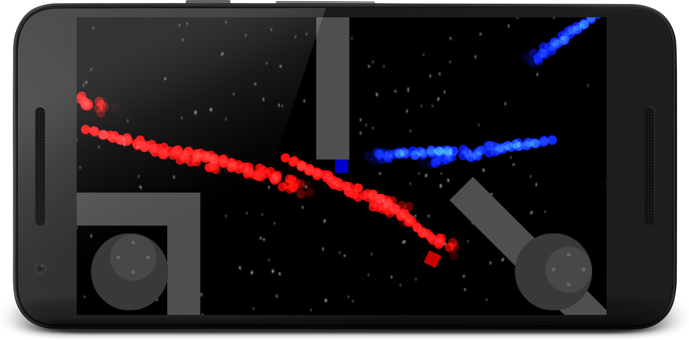

# Coherence
Coherence is a space shooter for Android. Show your laser rifle skills in this top-view arena style blaster. You have one objective, kill the RED agent. That is all, do not dissapont me.

## Install

## Creators
[Toni Karppi](https://github.com/pqbyte)

[Carl Leijonberg](https://github.com/carllei)

## History
Coherence is a university project for the Royal Institute of Technology(KTH). It was specifically made for the course DD1349.

## Attributions
[Can be found here](ATTRIBUTIONS.md)
